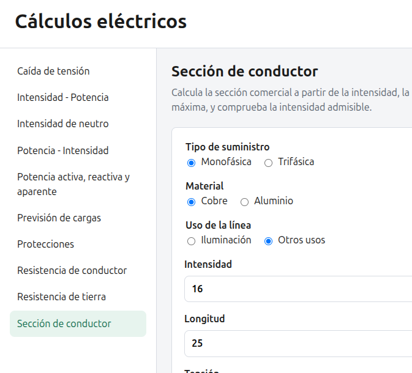

# Cálculos eléctricos

Herramienta web para cálculos habituales en instalaciones eléctricas de baja tensión. Está pensada como apoyo al dimensionado: introduces los datos de la instalación y obtienes el resultado, la fórmula aplicada y la referencia normativa cuando corresponde.

[Usar en el navegador](https://qserrano.github.io/calculos-electricos/)



Los valores que propone (secciones, calibres, caídas de tensión, etc.) son **orientativos**. No sustituyen el proyecto, la comprobación in situ ni el criterio del instalador o proyectista.

## Cálculos

- **Caída de tensión** — ΔU en líneas monofásicas o trifásicas, según material, aislante y sección.
- **Intensidad - Potencia** — corriente a partir de la potencia, la tensión y el factor de potencia.
- **Intensidad de neutro** — desequilibrio entre fases, resistencia de fase y de neutro, y caída asociada.
- **Potencia - Intensidad** — potencia a partir de la intensidad.
- **Potencia activa, reactiva y aparente** — P, Q y S en monofásico o trifásico.
- **Previsión de cargas** — edificio de viviendas según ITC-BT-10 (viviendas, servicios generales y locales).
- **Protecciones** — magnetotérmico (Ib ≤ In ≤ Iz) y diferencial, según ITC-BT-19 e ITC-BT-24.
- **Resistencia de conductor** — R del cable según longitud, sección, material y aislante.
- **Resistencia de tierra** — picas, conductor enterrado o placa, según ITC-BT-18.
- **Sección de conductor** — sección por caída de tensión e intensidad máxima admisible (valores de tabla orientativos).

Constantes de partida (230 V / 400 V, cos φ, límites de caída, secciones mínimas) y tablas de cables o protecciones están en `data/`.

## Uso local

La aplicación usa módulos ES y JSON importados, así que hay que servirla por HTTP (no basta con abrir `index.html` como archivo).

Con Python:

```bash
python3 -m http.server
```

Luego abre [http://localhost:8000](http://localhost:8000).

## Estructura

```
index.html          Punto de entrada
css/                Estilos
js/app.js           Navegación por hash (#caida-tension, …)
js/vistas/          Formularios y presentación de resultados
js/calculos/        Lógica de cada cálculo
js/utils/           Validación y formato
data/               Tablas, constantes y referencias (ITC, UNE)
```

## Licencia

[MIT](LICENSE)
